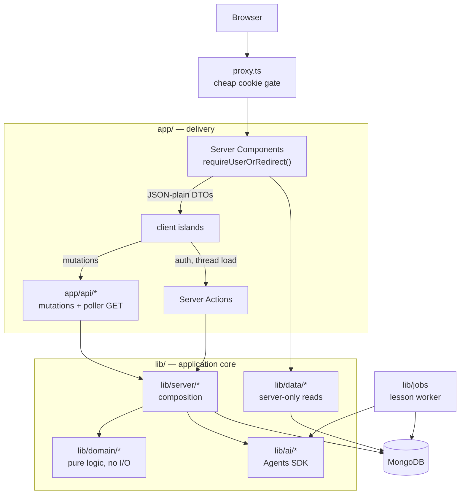
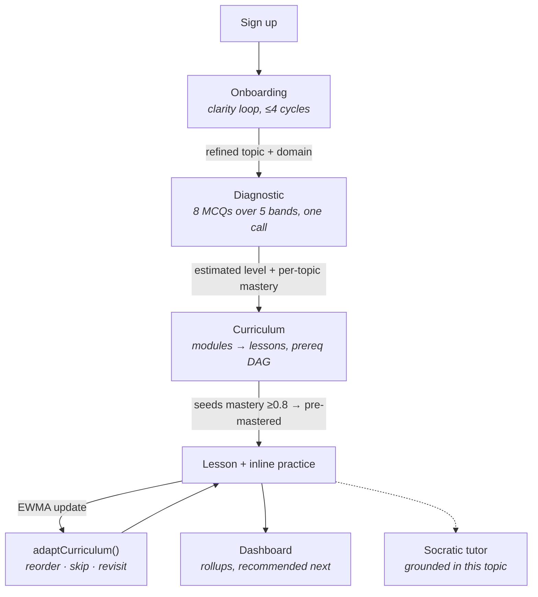
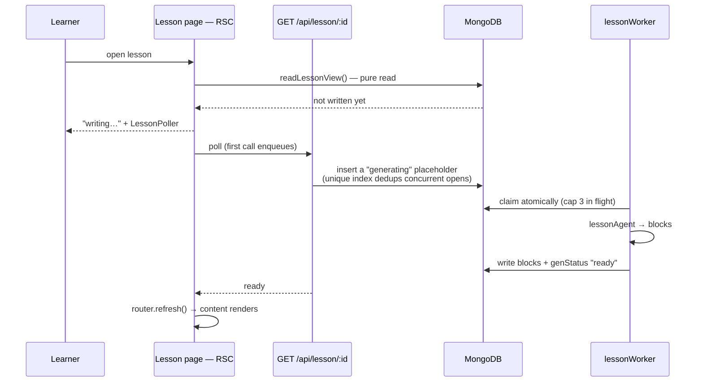

# LearnPath

**An adaptive learning platform that builds a curriculum around what you already know — and rebuilds it as you learn.**

A learner describes a goal in plain language. LearnPath clarifies it, diagnoses their
level with a generated diagnostic, authors a prerequisite-ordered curriculum, teaches it
with interactive lessons, and continuously reorders the path from measured mastery — with
a Socratic tutor grounded in the learner's own material alongside it.

<sub>Next.js 16 (App Router, RSC) · React 19 · MongoDB + Mongoose · OpenAI Agents SDK · Zod · Tailwind v4 + shadcn/ui · Vitest</sub>

---

## The core idea: the model writes, the system decides

Most "AI tutor" implementations hand the whole loop to the model — including what to teach
next. LearnPath draws a hard line through the middle:

| Concern | Owner | Where |
| --- | --- | --- |
| Authoring questions, lessons, explanations, tutoring | **LLM** | `lib/ai/agents/*` |
| Judging a free-text answer (verdict + confidence) | **LLM** | `lib/ai/agents/grading.ts` |
| Mastery, ordering, gating, what comes next | **Deterministic code** | `lib/domain/*` |

Everything in `lib/domain/` is pure, synchronous, I/O-free, and unit-tested. A model may
*judge* an answer, but it never computes a mastery score and never decides what comes next:
`runAnswerGradeAgent()` returns only `{ correct, confidence }`, and deterministic code turns
that into a number (`outcomeFromGrade` → `updateMastery`) and then into an ordering. That
boundary is what makes adaptation reproducible — the same events always produce the same
path, and swapping models changes prose quality, not pedagogy.

**Three consequences worth knowing about:**

- **Adaptation is a pure function.** `adaptCurriculum()` takes a curriculum and returns a
  reordered one — skip mastered, hoist needs-review, sort weakest-first, all respecting the
  module prerequisite DAG via topological sort. No I/O, no model call, fully testable.
- **One grader, no drift.** `gradeMcq()` runs on the server (authoritative, moves mastery)
  *and* in the browser (instant feedback, zero round-trip) — the same function, so the two
  verdicts cannot diverge.
- **The model is a replaceable component.** Provider config is a base URL + model name. It
  currently runs on NVIDIA's Llama 3.3 70B gateway; Gemini or any OpenAI-compatible endpoint
  works without a code change.

---

## Architecture

### Request model: server-first, thin mutation surface

Pages are async React Server Components that authenticate and read through a `server-only`
data access layer. They do **not** fetch their own data over HTTP. What remains in
`app/api/` is the mutation surface plus one poller GET — roughly a dozen endpoints instead
of one per view.



Layers, innermost outward:

```
lib/domain/    Pure logic. No I/O and no model calls — it imports document *types*
                 only, never the database itself. Unit-tested.
                 assessment · mastery (EWMA) · grade · adapt (topo sort)
lib/server/    Composition: AI output → domain rules → DB shape.
                 assessmentFlow · curriculumBuild · curriculumLocate · curriculumView
lib/data/      server-only reads that pages render from. Returns JSON-plain DTOs.
lib/ai/        Agents SDK: provider, runAgent (strict outputType + one corrective retry),
                 zod schemas, six agents (clarity, quizGen, grading, curriculum, lesson, tutor)
lib/db/        Mongoose connection (cached on globalThis, HMR-safe), schemas, TS interfaces
lib/auth/      bcrypt + jose JWT + server-revocable sessions; requireUser() is the real check
lib/jobs/      Background lesson worker (atomic claim, concurrency cap, stale reaper)
```

The dependency rule is one-directional: `domain` depends on nothing but types; `server`
composes `domain` + `ai` + `db`; `data` and `app/api` sit on top. `proxy.ts` is only a
cheap cookie-presence gate (it runs on prefetches, so it never touches the DB) —
`requireUser()` / `requireUserOrRedirect()` are the authoritative checks.

### The learner pipeline



**Diagnostic.** Eight MCQs spread across five difficulty bands, generated in a single call
and graded as a batch. The level estimate is the highest *contiguously passed* band, which
rejects lucky hits on hard questions. A second round is appended only when results are
non-monotonic (a harder band passed while an easier one failed — the signature of guessing),
so the common case finishes in one round with no half-finished state. Every question carries
an explicit "I don't know" option, which grades as incorrect rather than polluting the
signal with a coin flip.

**Mastery.** Exponentially weighted moving average per lesson, `0.5·outcome + 0.5·prior`,
seeded from the diagnostic rather than from zero. `≥0.8` marks mastered, `<0.4` marks
needs-review.

**Adaptation.** Deterministic, run on every lesson completion: skip mastered, hoist
needs-review, reorder weakest-first within prerequisite constraints, bump the curriculum
version. Module access is a sliding window — the next two incomplete modules plus everything
already completed — applied at both write and read, so existing curricula pick up the rule
without a migration.

### Lesson generation is a job, not a request

Authoring a lesson takes tens of seconds. Blocking a request on it would be a bad page and
a worse prefetch story, so generation is queued and the page polls.



**Rendering must never enqueue.** Link prefetch executes Server Components, so a dashboard
listing twenty lessons would otherwise fire twenty LLM jobs on hover. The page read is
strictly pure; only the poller's explicit GET enqueues. The result is that leaving the page
doesn't cancel generation, reopening doesn't duplicate it, and a server restart re-claims
jobs whose worker died mid-flight (claims older than five minutes are reaped).

### Practice grading, split by question type

- **Multiple choice** ships its `correctKey` and `explanation` with the lesson, so the
  browser grades locally and reveals the verdict with no round trip. The POST still fires in
  the background, because the *server* re-grade is what moves mastery; only its failure
  surfaces. The trade-off is deliberate: devtools reveals the key early, which lets a learner
  spoil their own mastery signal — but never fake a score, since the server never trusts the
  client's verdict.
- **Short answer** reveals nothing. The rubric and explanation stay server-side and the
  answer is graded by an agent.

`rubric` is never sent to the client for any block kind.

**Retakes don't inflate mastery.** Any question can be reset and retried — the replay is
still graded, but the answer has been on screen since the first attempt, so the client marks
it `countsTowardMastery: false` and the route skips both the mastery write and the progress
event. Preserve that flag if you add another practice surface; without it, "try again" is a
one-click mastery inflator.

### Tutor grounding

Each topic holds many conversation threads, keyed by `_id`. Relevant material — the
curriculum outline plus lesson excerpts found by keyword search, scoped to
`userId + curriculumId` — is injected into the prompt every turn.

The same retrieval also exists as a proper Agents SDK tool, but it is **not** attached to
the live agent: the current model hangs when a tool is present over Chat Completions. Point
`GEMINI_MODEL` at a tool-reliable model and the tool can be re-attached in place of
injection.

### Data model

| Collection | Holds |
| --- | --- |
| `users` | email (unique, lowercased), password hash |
| `sessions` | server-revocable session records; TTL index expires them, deleting the doc is logout |
| `onboarding` | clarity loop state: raw description, refined topic, domain, exchanges |
| `assessments` | bands, rounds, questions (with the learner's answers) + computed result |
| `curricula` | modules → lessons, prerequisites, status, mastery scores, version |
| `lessons` | generated content blocks (flat tagged shape; `kind` selects fields) |
| `progressEvents` | append-only log — powers dashboard time and history |
| `chats` | one tutor thread each; many per topic |

A learner can study **several topics at once** — one topic is one curriculum, and nothing is
one-at-a-time. Topic-scoped reads accept an optional `curriculumId` and default to the most
recent.

**Every id-scoped query is filtered by owner** (`{ _id, userId }`) and 404s on a miss.
Accepting a client-supplied id without that filter would let any user read another's topic;
it is the single most important invariant to preserve when adding topic-scoped endpoints.

---

## Quickstart

**Prerequisites:** Node, Docker (for local MongoDB), and an API key for any
OpenAI-compatible model endpoint.

```bash
npm install                  # npm only — package-lock.json is authoritative
cp .env.example .env.local   # fill SESSION_SECRET + GEMINI_API_KEY
npm run dev                  # http://localhost:3000
```

`npm run dev` auto-starts MongoDB for you: a `predev` hook launches the `learnpath-mongo`
container (`mongo:7`, port 27017). The hook skips itself when `MONGODB_URI` points
somewhere non-local, such as Atlas.

<details>
<summary><b>Environment variables</b></summary>

| Variable | Notes |
| --- | --- |
| `MONGODB_URI` | No database path — `MONGODB_DB` is passed separately |
| `MONGODB_DB` | Defaults to `learnpath` |
| `SESSION_SECRET` | Signs the session JWT: `node -e "console.log(require('crypto').randomBytes(48).toString('base64url'))"` |
| `GEMINI_API_KEY` | Any OpenAI-compatible provider — the `GEMINI_*` names are historical |
| `GEMINI_BASE_URL` | **The API root only** (ends at `/v1`). Do not include `/chat/completions`; the SDK appends it — a wrong base gives a `404` from the doubled path |
| `GEMINI_MODEL` | e.g. `gemini-2.5-flash`, `meta/llama-3.3-70b-instruct` |

</details>

<details>
<summary><b>Troubleshooting</b></summary>

- **Docker needs `sudo`?** You'll be prompted each run. Fix it once with
  `sudo usermod -aG docker $USER`, then re-login. To start Mongo manually instead:
  `docker run -d --name learnpath-mongo -p 27017:27017 mongo:7`.
- **`npm run dev` exits silently after `✓ Ready`**, or `Module not found: Can't resolve
  '@openai/agents-core'` — `node_modules` is partially extracted. Fix:
  `rm -rf node_modules && npm ci`. Use npm only in this repo.

</details>

---

## API

Auth is an httpOnly session cookie; protected routes call `requireUser()`. Test with
`curl -c jar -b jar`.

Pages don't consume these for their data — they're Server Components reading through
`lib/data/*`. What's here is the mutation surface, the lesson poller's GET, and JSON auth
for scripts (the app itself signs in through Server Actions).

| Method | Path | Purpose |
| --- | --- | --- |
| `POST` | `/api/auth/signup` · `/login` · `/logout` | Email + password (JSON, for scripts; the UI uses Server Actions) |
| `POST` | `/api/onboarding/clarity` | Clarity loop — repeat until `done`; `restart:true` starts a new topic |
| `POST` | `/api/assessment/start` | Generate a fresh diagnostic, or report the resumable/completed one |
| `POST` | `/api/assessment/submit` | Grade the batch → score, level, review, optional refinement round |
| `POST` | `/api/curriculum/generate` | Build the path from a finished assessment |
| `GET` | `/api/lesson/[id]` | Lesson content; enqueues generation if unwritten (the poller) |
| `POST` | `/api/lesson/[id]/practice` | Grade inline practice → mastery |
| `POST` | `/api/progress/complete` | Finalize a lesson and run adaptation |
| `POST` | `/api/tutor` | Socratic tutor — new thread, or continue with `conversationId` |
| `GET` | `/api/health` | Ops check (public) |

Topic-scoped endpoints take an optional `curriculumId` (query or body) and default to the
most recent topic.

---

## Testing

```bash
npm test                   # 84 unit tests, fast and deterministic
npm run test:integration   # live-LLM agent tests (slow; self-skips without GEMINI_API_KEY)
npm run test:all           # both
```

Vitest. The unit suite covers `lib/domain/*`, `lib/server/*`, auth, and the HTTP layer —
everything that decides what a learner sees. Integration tests exercise the agents against a
real endpoint. Route handlers, the DB layer, and session JWT handling are not yet covered;
route-level tests against a seeded Mongo are the next target.

---

## Frontend

Server Components render every page; interactivity lives in small client islands
(`LoginForm`, `PracticeBlock`, `LessonPoller`, `TutorChat`, `OnboardingChat`,
`AssessmentClient`). Anything crossing that boundary must be JSON-plain — the DTOs in
`lib/data/types.ts` exist for exactly that.

UI is shadcn/ui on Tailwind v4. Add components with `npx shadcn@latest add <name>`; never
hand-write into `components/ui/`. Model-authored markdown renders through
`components/Markdown.tsx` with raw HTML escaped.

**Accent color is one knob.** `app/globals.css` defines `--brand` / `--brand-foreground` at
the top of `:root` (and `.dark`), and `--primary` is wired to them — change those two values
to recolor actions, links, and highlights app-wide.

---

## Scripts

`npm run dev` · `build` · `start` · `lint` · `test` · `test:integration` · `test:all` · `test:watch`

---

## Further reading

- **`summary.md`** — architecture deep-dive, per-module code map, AI integration gotchas,
  known limitations.
- **`AGENTS.md`** — required reading before writing code. This is Next.js 16: `params` and
  `searchParams` are Promises, middleware is `proxy.ts`, and several conventions differ from
  older App Router code.
